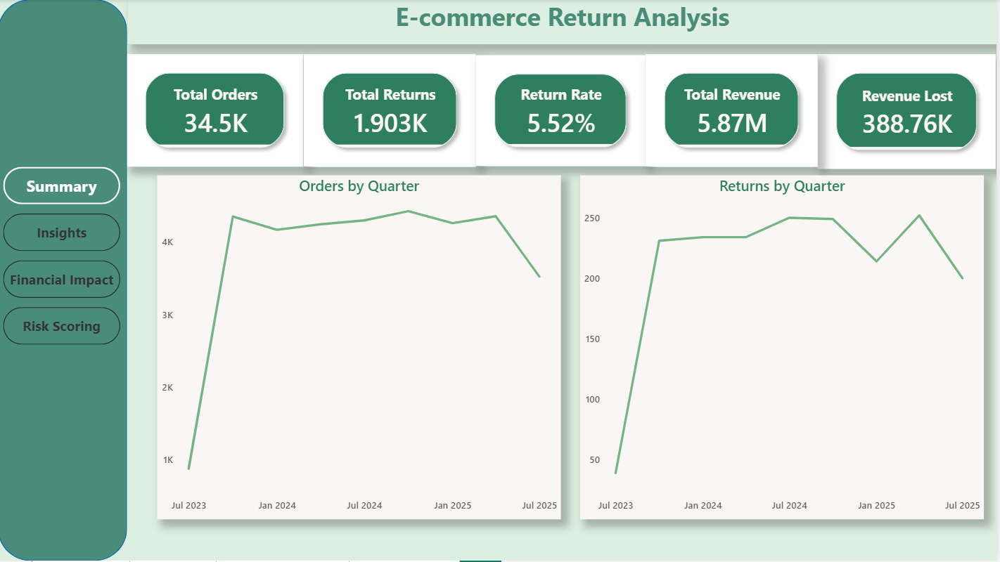
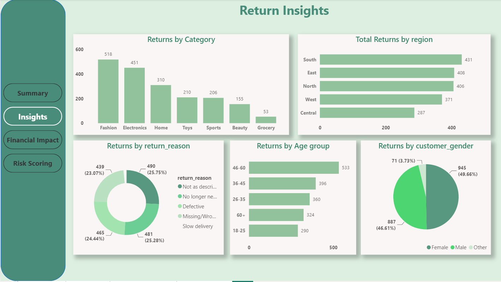
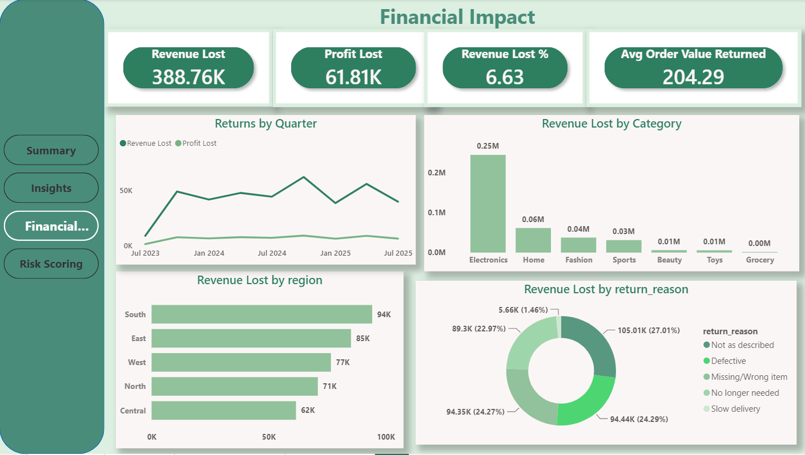
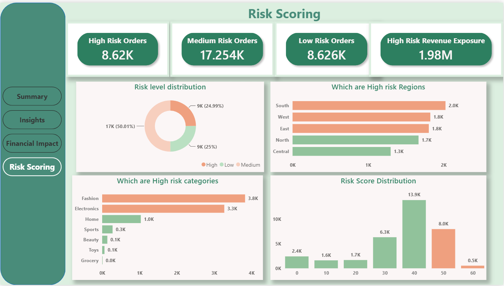

# 🛒 E-Commerce Return Rate Reduction Analysis

> An end-to-end Data Analytics & Machine Learning project that analyzes e-commerce return behavior, quantifies financial impact, scores orders by return risk, and delivers actionable business recommendations through an interactive Power BI dashboard.


---

## 📌 Project Overview

Product returns are one of the biggest challenges in e-commerce — driving revenue loss, increased operational cost, and reduced profitability. This project analyzes **34,500 e-commerce orders** across 7 product categories and 5 regions to understand return behavior, quantify its financial impact, and identify which orders are most likely to be returned.

The project follows a complete analytics workflow — from raw data to a decision-ready Power BI dashboard — using **SQL, Python, Machine Learning, and Power BI**.

> **Note on scope:** While the project includes a return-risk prediction model, the primary objective and main analytical value of this project is descriptive and diagnostic — identifying *why* returns happen and *where* the business is losing money — rather than achieving high-accuracy prediction. This is reflected in the project title and is discussed further in the Machine Learning section below.
📄 **[Read the full Business Recommendations Report →](./RECOMMENDATIONS.md)**
---

## 🎯 Business Objectives

- Quantify the overall return rate and its financial impact
- Identify which product categories and regions drive the most returns
- Determine the leading causes of returns
- Engineer features that capture financial, behavioral, and operational return signals
- Build a return-risk scoring model to flag high-risk orders
- Deliver an interactive Power BI dashboard for business stakeholders
- Translate findings into concrete, prioritized recommendations

---

## 🛠 Tech Stack

| Category | Tools |
|---|---|
| Programming | Python |
| Data Analysis | Pandas, NumPy |
| Visualization | Matplotlib, Seaborn |
| Database | SQL (PostgreSQL / pgAdmin) |
| Machine Learning | Scikit-learn, XGBoost |
| Dashboard | Power BI |
| Documentation | Jupyter Notebook |

---

## 📂 Repository Structure

```text
ecommerce-return-reduction-analysis/
│
├── data/
├── notebooks/
├── sql/
├── dashboard/
├── reports/
├── screenshots/
└── README.md
```

---

## 📊 Project Workflow

```
Raw Dataset
      │
      ▼
Data Cleaning & Preparation
      │
      ▼
SQL Business Analysis
      │
      ▼
Exploratory Data Analysis (EDA) + Statistical Testing
      │
      ▼
Feature Engineering
      │
      ▼
Machine Learning (Return Risk Scoring)
      │
      ▼
Feature Importance Analysis
      │
      ▼
Business Recommendations
      │
      ▼
Power BI Dashboard
```

---

## 🔍 Project Phases

### Phase 1 — Data Preparation
- Missing value handling and data type correction
- Datetime parsing for order, delivery, and request dates
- Feature creation: `delivery_days`, `discount_pct`, `age_group`, `order_value`
- Outlier handling on `profit_margin` (99th percentile capping)

### Phase 2 — SQL Business Analysis
Business questions answered using SQL:
- Overall return rate, revenue lost, and profit lost
- Return rate and financial impact by category and region
- Most common return reasons, and reasons by category
- Return rate by gender, age group, and payment method

### Phase 3 — Exploratory Data Analysis & Statistical Testing
- Univariate distributions of price, discount, delivery days, profit margin
- Returned vs. non-returned comparisons using Mann-Whitney U tests
- Category × region return rate heatmap
- Correlation analysis across numeric features

**Key statistical finding:** Price, order value, and profit margin differ significantly between returned and non-returned orders (p < 0.001), while delivery days (p = 0.411) and discount (p = 0.775) show no significant difference — indicating returns are driven by financial/product factors rather than logistics.

### Phase 4 — Feature Engineering
Engineered features designed to capture behavioral, financial, and operational return signals:

| Feature | Description |
|---|---|
| `region_return_risk` | Target-encoded historical return rate by region (computed on training data only to prevent leakage) |
| `delivery_speed` | Delivery days grouped into Fast / Standard / Slow |
| `discount_band` | Discount grouped into No Discount / Low / Medium / High |
| `high_value_order` | Binary flag for orders above the median order value |
| `price_discount_interaction` | Price × discount, capturing combined pricing effects |
| `profit_pressure` | Total amount × profit margin, capturing financial magnitude per order |

Categorical features (`delivery_speed`, `discount_band`, `category`, `region`) were one-hot encoded. Post-event columns (`return_reason`, `return_date`) and identifier columns were explicitly excluded from the model to prevent data leakage.

### Phase 5 — Machine Learning
Three models were trained and compared on a held-out test set:

| Model | Purpose |
|---|---|
| Logistic Regression | Baseline, linear, interpretable |
| Random Forest | Non-linear relationships, primary model |
| XGBoost | Gradient boosting, imbalance handling via `scale_pos_weight` |

**Why performance is moderate, and why that's reported honestly:** The dataset has a severe class imbalance (5.5% return rate) and lacks features that are typically the strongest real-world return predictors — customer return history, product ratings, and fulfilment-level data. All three models converged around **ROC-AUC ≈ 0.60–0.61**, which reflects this data constraint rather than a flaw in modeling approach. Class weighting and threshold tuning (rather than the default 0.5) were used to prioritize **recall** over raw accuracy, since the business cost of missing a return is higher than the cost of a false alarm. The best-performing configuration achieved **recall of ~83–92%** on the minority class at the cost of precision — an intentional trade-off for a proactive flagging system.

### Phase 6 — Feature Importance
Feature importance was extracted from the Random Forest model (`.feature_importances_`):

| Rank | Feature | Importance |
|---|---|---|
| 1 | `profit_margin` | 0.140 |
| 2 | `profit_pressure` | 0.134 |
| 3 | `shipping_cost` | 0.133 |
| 4 | `price` | 0.126 |
| 5 | `customer_age` | 0.085 |
| 6 | `price_discount_interaction` | 0.069 |
| 7 | `category_Grocery` | 0.062 |
| 8 | `category_Fashion` | 0.043 |
| 9 | `delivery_days` | 0.035 |
| 10 | `region_return_risk` | 0.027 |

**Insight:** Financial magnitude features — profit margin, shipping cost, and price — are the strongest predictors of return likelihood, more so than category or region. This is a meaningful finding in its own right: it suggests return risk is more closely tied to *how much is financially at stake* in an order than to *which category or region* it belongs to, complementing the category/region-level patterns found in the SQL and EDA phases.

### Phase 7 — Return Risk Scoring
Every order was scored with a return probability and classified into risk bands:
- 🟢 **Low Risk**
- 🟡 **Medium Risk**
- 🔴 **High Risk**

Risk bands were calibrated to the model's actual probability distribution (rather than fixed 0–100 thresholds), since Random Forest outputs on this imbalanced dataset are naturally conservative. This enables proactive identification of orders most likely to be returned, before fulfilment.

### Phase 8 — Business Recommendations
Findings from SQL, EDA, and feature importance were translated into seven prioritized, evidence-backed recommendations — including product listing improvements for high-risk categories, fulfilment accuracy initiatives, and a clear case against over-investing in delivery speed.

---

## 📈 Power BI Dashboard

The interactive dashboard consists of four pages, each built around a single business question:

### 🏠 Executive Overview
KPI summary (orders, return rate, revenue lost, profit lost) and monthly return trend — the full picture at a glance.

### 🔄 Return Analysis
Return rate by category, region, return reason, and a category × region heatmap to identify where returns concentrate.

### 💰 Financial Impact
Revenue and profit lost by category and return reason, quarterly loss trend, and returned vs. non-returned average order value.

### ⚠️ Risk Scoring
Risk distribution, high-risk orders by category and region, and a sortable, filterable table of flagged orders for operational follow-up.

All pages share a consistent monochromatic navy theme, in-page navigation, and synced category/region filters across the analytical pages.

---

## 💡 Key Business Insights

- Fashion (8.28%) and Electronics (7.30%) have the highest return rates, both well above the 5.52% overall average.
- "Not as described" is the single costliest return reason, accounting for the largest share of revenue loss.
- Product and fulfilment issues account for over 98% of return-related financial losses; delivery speed accounts for under 2%.
- Returned orders carry significantly higher average value than non-returned orders (statistically validated, p < 0.001), increasing financial exposure.
- Feature importance shows profit margin, shipping cost, and price as the strongest return predictors — return risk is closely tied to the financial profile of an order.
- Grocery has the lowest return rate but a negative average profit margin — a separate profitability issue, not a returns issue.

---

## 📸 Dashboard Preview

### Executive Overview
 

### Return Analysis



### Financial Impact


### Risk Scoring


---

## 🚀 Business Impact

This project demonstrates how data analytics can help an e-commerce business:
- Quantify and prioritize the financial impact of product returns
- Identify the specific categories, regions, and reasons driving losses
- Distinguish genuine return drivers (product quality, financial magnitude) from non-drivers (delivery speed, discounting)
- Proactively flag high-risk orders for review before fulfilment
- Make resourcing decisions backed by statistically validated evidence rather than assumption

---

## 🔭 Future Improvements

- Incorporate customer-level return history, which is typically the strongest real-world return predictor
- Add product review/rating data to better capture "not as described" risk
- Add fulfilment-center-level data to localize wrong-item and defect issues
- Re-run target encoding to include `category_return_risk` (a planned feature not present in the current model) alongside `region_return_risk`

---

## 👨‍💻 Author

**Sajja Yasodha Krishna**
Aspiring Data Analyst passionate about solving business problems using SQL, Python, Machine Learning, and Power BI.

- 📧 Email: krishnayasodha616@gamil.com
- 🔗 LinkedIn: https://www.linkedin.com/in/yasodha-krishna-sajja-114aa72b7/n
- 💻 GitHub: https://github.com/Yasodha-Krishna-Sajja

---

⭐ If you found this project useful, consider giving it a star!
